# Polyglot Codebase Knowledge Graph

> Generated offline by **readmenator**. Supports C, C++, Python, Go, Rust, JS/TS, Java, C#, Shell, PHP, Dart, GDScript, Nim, ASM.
> No LLMs. No tokens. Pure static analysis.

**Total Files Parsed:** 1 | **Total Symbols Extracted:** 2 | **Total Imports:** 8

## Structural Knowledge Map

```mermaid
graph TD
    classDef mod fill:#1e1e1e,stroke:#ff6666,stroke-width:2px,color:#fff;
    classDef cls fill:#2d2d2d,stroke:#4ec9b0,stroke-width:2px,color:#fff;
    classDef fn fill:#333,stroke:#dcdcaa,stroke-width:1px,color:#dcdcaa;
    classDef ext fill:#111,stroke:#666,stroke-dasharray: 5 5,color:#aaa;
    app_py["app.py (py)"]
    class app_py mod;
    app_py_wheelEvent["wheelEvent"]
    class app_py_wheelEvent fn;
    app_py --> app_py_wheelEvent
    app_py_update_freq["update_freq"]
    class app_py_update_freq fn;
    app_py --> app_py_update_freq
    ext_math["math"]
    class ext_math ext;
    app_py -.->|imports| ext_math
    ext_numpy["numpy"]
    class ext_numpy ext;
    app_py -.->|imports| ext_numpy
    ext_pygame["pygame"]
    class ext_pygame ext;
    app_py -.->|imports| ext_pygame
    ext_time["time"]
    class ext_time ext;
    app_py -.->|imports| ext_time
    ext_PyQt5_QtWidgets["PyQt5.QtWidgets"]
    class ext_PyQt5_QtWidgets ext;
    app_py -.->|imports| ext_PyQt5_QtWidgets
    ext_PyQt5_QtGui["PyQt5.QtGui"]
    class ext_PyQt5_QtGui ext;
    app_py -.->|imports| ext_PyQt5_QtGui
    ext_PyQt5["PyQt5"]
    class ext_PyQt5 ext;
    app_py -.->|imports| ext_PyQt5
    ext_PyQt5_QtCore["PyQt5.QtCore"]
    class ext_PyQt5_QtCore ext;
    app_py -.->|imports| ext_PyQt5_QtCore
```

---

## Architecture Reference

### PY (1 files)

#### `app.py`
**Path:** `app.py`

**Functions:**
- `wheelEvent` (line 14)
- `update_freq` (line 77)
