# Polyglot Codebase Knowledge Graph

> Generated offline by **readmenator**. 1 files, 2 symbols, 8 imports. Supports C, C++, Python, Go, Rust, JS/TS, Java, C#, Shell, PHP, Dart, GDScript, Nim, ASM, Ruby, Swift, Kotlin, Scala, Lua, Elixir.
> No LLMs. No tokens. Pure static analysis. See more [here](https://github.com/grisuno/ReadMenator)

**Start here:** Statistics Dashboard for scope, God Nodes for blast radius, Architecture Reference for per-file API. Agents: prefer `readmenator-agent/INDEX.md` + `SYMBOLS.md`.

**Wiki:** prefer `readmenator-wiki/index.md` for progressive disclosure: one synthesis page per community, `connections.json` with EXTRACTED vs INFERRED confidence, `queries.md` log, `REPORT.md` audit.

**Confidence:** EXTRACTED = parsed from source, INFERRED = heuristic bridge, AMBIGUOUS = reported, never hidden. See `readmenator-wiki/REPORT.md`.

**Total Files Parsed:** 1 | **Total Symbols Extracted:** 2 | **Total Imports:** 8

<!-- ranking_model: v1.0 | weights: {ppr:0.45,auth:0.2,test:0.15,doc:0.1,fresh:0.1} | alpha:0.85 | commit:1e0fd0b | date:2026-07-18 -->


## Table of Contents

1. [Statistics Dashboard](#statistics-dashboard)
2. [Architectural Layers](#architectural-layers)
3. [Ranked Context](#ranked-context)
4. [God Nodes](#god-nodes)
5. [Suggested Questions](#suggested-questions)
6. [Hotspot Analysis](#hotspot-analysis)
7. [Change Impact Analysis](#change-impact-analysis)
8. [Orphans](#orphans)
9. [Query Recipes](#query-recipes)
10. [Structural Knowledge Map](#structural-knowledge-map)
11. [UML Class Diagram](#uml-class-diagram)
12. [Code Property Graph](#code-property-graph)
13. [Architecture Reference](#architecture-reference)
    - [PY (1 files)](#py-1-files)

---

## Statistics Dashboard

| Metric | Value |
|--------|-------|
| Total Files | 1 |
| Total Symbols | 2 |
| Total Imports | 8 |
| Call Edges | 7 |
| Inheritance Edges | 0 |
| Languages | 1 |
| Avg Symbols/File | 2.0 |
| Avg Imports/File | 8.0 |

### Top Files by Import Count (Fan-Out)

| File | Imports | Symbols | Language |
|------|---------|---------|----------|
| `app.py` | 8 | 2 | py |

---

## Architectural Layers

Auto-detected from path patterns, naming conventions, and imported frameworks.

| Layer | Files |
|-------|-------|
| utility | 1 |

### utility

- `app.py` (py, 2 symbols)

---

## Ranked Context

Files ranked by composite score for the current query context. The ranking combines Personalized PageRank (query relevance), global authority, test coverage, documentation coverage, and code freshness. Model: v1.0.

| Rank | File | Composite | PPR | Authority | Test | Doc |
|------|------|-----------|-----|-----------|------|-----|
| 1 | `app.py` | 0.0000 | 0.0000 | 0.0000 | 0.00 | 0.00 |

---

## God Nodes

Most architecturally central files ranked by combined import/export degree and symbol richness.

| File | Score | Connections | PageRank |
|------|-------|-------------|----------|
| `app.py` | 0.2 | | 0.0000 |

---

## Suggested Questions

Auto-generated exploration prompts based on graph structure:

- What does app.py depend on, and what depends on it? (0 connections)
- What is the overall architecture of this codebase?

---

## Hotspot Analysis

Files ranked by combined complexity (symbol count) and centrality (connection count). High-scoring files are architecturally critical and may need refactoring attention.

| File | Complexity | Centrality | Combined | Symbols | Connections |
|------|-----------|------------|----------|---------|-------------|
| `app.py` | 1.000 | 1.000 | 1.000 | 2 | 8 |

---

## Change Impact Analysis

Files sorted by how many other files would be affected if they changed. High-impact files should be changed with caution.

| File | Direct Dependents | Transitive Dependents | Total Impact |
|------|------------------|----------------------|--------------|
| `app.py` | 0 | 0 | 0 |

---

## Orphans

Files with no documentation or low connectivity. These are candidates for documentation investment or cleanup.

- `app.py` (2 symbols, no doc)

---

## Query Recipes

Example queries you can run against this knowledge base using the ranking engine:

```
# Find files most relevant to a concept
readmenator query "Where is the import resolver implemented?"

# Rank files by relevance to a topic
readmenator query "How does documentation generation work?"

# Explain why a file ranks highly
readmenator query "explain readmenator/_documentation.py"

# Trace dependency paths with ranked context
readmenator query "path from CLI to exporter"
```

The ranking model uses the following signals:

- **Personalized PageRank** (45% weight): query-specific relevance via seed propagation
- **Global Authority** (20% weight): structural importance via standard PageRank
- **Test Coverage** (15% weight): fraction of symbols referenced in test files
- **Doc Coverage** (10% weight): presence of docstrings and file-level docs
- **Freshness** (10% weight): recent modification activity

Results include score decomposition and justification paths for each ranked item.

---

## Structural Knowledge Map

```mermaid
graph TD
    classDef mod fill:#1e1e1e,stroke:#ff6666,stroke-width:2px,color:#fff;
    classDef cls fill:#2d2d2d,stroke:#4ec9b0,stroke-width:2px,color:#fff;
    classDef fn fill:#333,stroke:#dcdcaa,stroke-width:1px,color:#dcdcaa;
    classDef ext fill:#111,stroke:#666,stroke-dasharray: 5 5,color:#aaa;
    app_py["app.py (py)"]
    class app_py mod;
    app_py_wheelEvent["wheelEvent"]
    class app_py_wheelEvent fn;
    app_py --> app_py_wheelEvent
    app_py_update_freq["update_freq"]
    class app_py_update_freq fn;
    app_py --> app_py_update_freq
    ext_math["math"]
    class ext_math ext;
    app_py -.->|imports| ext_math
    ext_numpy["numpy"]
    class ext_numpy ext;
    app_py -.->|imports| ext_numpy
    ext_pygame["pygame"]
    class ext_pygame ext;
    app_py -.->|imports| ext_pygame
    ext_time["time"]
    class ext_time ext;
    app_py -.->|imports| ext_time
    ext_PyQt5_QtWidgets["PyQt5.QtWidgets"]
    class ext_PyQt5_QtWidgets ext;
    app_py -.->|imports| ext_PyQt5_QtWidgets
    ext_PyQt5_QtGui["PyQt5.QtGui"]
    class ext_PyQt5_QtGui ext;
    app_py -.->|imports| ext_PyQt5_QtGui
    ext_PyQt5["PyQt5"]
    class ext_PyQt5 ext;
    app_py -.->|imports| ext_PyQt5
    ext_PyQt5_QtCore["PyQt5.QtCore"]
    class ext_PyQt5_QtCore ext;
    app_py -.->|imports| ext_PyQt5_QtCore
```



---

## Code Property Graph

Machine-readable Code Property Graph (CPG) in JSON-LD format. This block allows AI agents to parse the full structural graph without additional file reads. Compatible with GraphRAG pipelines.

```json
{"@context": "https://schema.org", "analysis": {"communities": [], "god_nodes": [{"node_id": "app.py", "score": 0.2}], "surprising_connections": []}, "edges": [{"confidence": "EXTRACTED", "relation": "imports", "source": "app.py", "target": "math"}, {"confidence": "EXTRACTED", "relation": "imports", "source": "app.py", "target": "numpy"}, {"confidence": "EXTRACTED", "relation": "imports", "source": "app.py", "target": "pygame"}, {"confidence": "EXTRACTED", "relation": "imports", "source": "app.py", "target": "time"}, {"confidence": "EXTRACTED", "relation": "imports", "source": "app.py", "target": "PyQt5.QtWidgets"}, {"confidence": "EXTRACTED", "relation": "imports", "source": "app.py", "target": "PyQt5.QtGui"}, {"confidence": "EXTRACTED", "relation": "imports", "source": "app.py", "target": "PyQt5"}, {"confidence": "EXTRACTED", "relation": "imports", "source": "app.py", "target": "PyQt5.QtCore"}], "generator": "readmenator", "metadata": {"edge_count": 15, "file_count": 1, "language_count": 1, "symbol_count": 2}, "nodes": [{"id": "app.py", "kind": "module", "label": "app.py", "language": "py", "sha256": "c30ac58e6a4a964a", "symbol_count": 2, "symbols": [{"kind": "function", "line": 14, "name": "wheelEvent", "signature": "def wheelEvent(event)"}, {"kind": "function", "line": 77, "name": "update_freq", "signature": "def update_freq(value)"}]}], "type": "CodePropertyGraph", "version": "1.0"}
```

---

## Architecture Reference

### PY (1 files)

#### `app.py`
**Path:** `app.py`

**Functions:**
- `wheelEvent` (line 14) `def wheelEvent(event)`
- `update_freq` (line 77) `def update_freq(value)`
